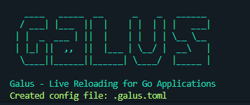

# Galus - Live Reloading for Go Applications



[**English**](README.md) | [**Bahasa Indonesia**](README-id.md)

Galus is a _live reloading_ tool for Go applications, similar to Air or CompileDaemon. It monitors file changes in your project, automatically recompiles, and restarts the application.

## Features

- **Live Reloading**: Automatically detects changes in specified file types (e.g., `.go`) and recompiles and restarts the application.

- **Configurable via .galus.toml**: Customize watched directories, file extensions, build commands, and runtime arguments using a TOML configuration file.

- **Colorful CLI Output**: Provides clear, color-coded output for better user experience (e.g., green for success, red for errors).

- **Rich CLI Commands**: Supports init to create a default configuration file, version to display the app version, and help for command usage details.

- **Graceful Shutdown**: Uses `SIGTERM` to safely stop running processes, with a fallback to force termination if needed.

- **Configuration Validation**: Ensures build_cmd and command_args are valid before starting the live reload process.

- **Cross-Platform**: Works on any platform supported by Go, with easy installation via go get.

## Installation

1. Install galus using `go get`:

   ```bash
   go get github.com/aliftech/galus
   ```

2. Install the binary to make galus available globally:

   ```bash
   go install github.com/aliftech/galus
   ```

3. Ensure `$GOPATH/bin` is in your `$PATH`:
   ```bash
   export PATH=$PATH:$(go env GOPATH)/bin
   ```

## Usage

1. **Initialize a configuration file**: In your project directory, run:

   ```bash
   galus init
   ```

   This creates a `.galus.toml` configuration file with default setting.

2. **Start live reloading**: In your project directory, run:

   ```bash
   galus
   ```

   Galus will monitor file changes (e.g., `.go` files), recompile, and restart your application.

## Configuration

The `.galus.toml` file allows you to customize Galus behavior. Example configuration:

```toml
root_dir = "."
tmp_dir = "tmp"
include_ext = ["go"]
exclude_dir = [".git", "vendor", "tmp"]
build_cmd = "go build -o ./tmp/main ."
binary_name = "tmp/main"
command_args = ["tmp/main"]
```

- `root_dir`: Directory to monitor for changes.
- `tmp_dir`: Temporary directory for compiled binaries.
- `include_ext`: File extensions to monitor (e.g., `["go", "html"]`).
- `exclude_dir`: Directories to ignore.
- `build_cmd`: Command to compile the application.
- `binary_name`: Name of the compiled binary.
- `command_args`: Arguments to run the binary.
